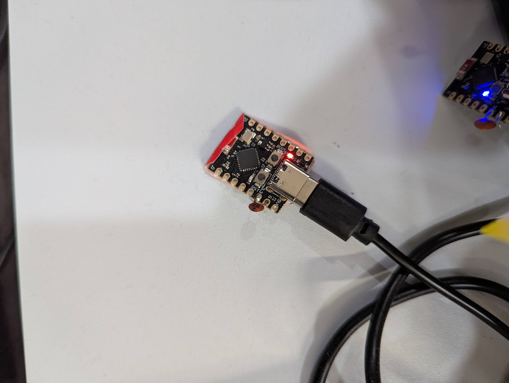

# QuietCool ESPHome Control

> [!NOTE]
> The QuietCool Smart Attic Fan Control works with both whole house fans and attic fans.  In my application, I used it for a whole house fan.  This project requires having a Smart Attic Fan Control, which can be purchased separately from QuietCool and is a drop-in replacement for the RF controller.

This repository contains ESPHome configurations for controlling QuietCool whole house fans and attic fans. QuietCool fans can be automated and integrated into your smart home using ESP32 devices flashed with these configurations.

The project provides a web-based installation interface using [ESP Web Tools](https://esphome.github.io/esp-web-tools/), making it easy to flash your ESP device directly from your browser.

## Configurations

### quietcool-smart-attic-fan-control.yaml

This configuration file provides smart control for QuietCool attic fans. Features include:

- Temperature-based automatic control
- Manual speed control (Low/High)
- Integration with Home Assistant
- Real-time temperature and humidity monitoring
- Enable mode switch (temperature-humidity driven, timer, idle)
- Automatic shutdown when attic temperature reaches desired level
- Web-based control interface

## Getting Started

1.  Pair your phone with the Smart Attic Fan Control.
2.  Retrieve the MAC address of your controller from the QuietCool app.
3.  Flash an ESP32 using this template.  See [Packages](https://next.esphome.io/components/packages) for details on how to use this repository in your ESPHome configuration.  The gist is that you can simply add the following YAML to your configuration:

``` yaml
substitutions:
    mac_address: "00:00:00:00:00:00" # Replace with your Smart Attic Fan Control's MAC address
    # This is the bluetooth MAC, not the WIFI Mac!

packages:
  remote_package_shorthand: github://phoeagon/quietcool-esphome/quietcool-smart-attic-fan-control.yaml@main

# This repo is configured for ESP32-C3, unlike awkaplan/quietcool-esphome.
# For other devices you may need to change the device section.
# ESP32-C3
# esp32:
#   board: esp32-c3-devkitm-1  # Most common generic C3 ID
#   variant: esp32c3
#   framework:
#     type: esp-idf            # Better for C3 than 'arduino'
#     version: recommended     # Uses the most stable IDF version
#     sdkconfig_options:
#       # Enables the coexistence algorithm to manage the shared antenna
#       CONFIG_ESP32_WIFI_SW_COEXIST_ENABLE: "y"
#       # Tells the chip to prefer WiFi stability during scans
#       CONFIG_BT_CTRL_BLE_MAX_ACT: "10"
```


4.  Add the ESPHome device to Home Assistant and update the pairing ID with a unique, 16-digit hex string.
5.  Use the QuietCool app to put the controller in pairing mode.
6.  Press the ESPHome device's pair button in Home Assistant.
7.  Forget the bluetooth device on your phone (optional).

## Credits

This project builds upon the research and development done by [@emerose](https://github.com/emerose/quietcool), who created a Python-based BLE client for the QuietCool Wireless RF Control Kit. Their work was instrumental in understanding the QuietCool BLE protocol and making this ESPHome integration possible.

## Contributing

Contributions are welcome! Please feel free to submit a Pull Request.

## Customization

You can customize the yaml on its behavior

```

# WiFi configuration with fallback access point
wifi:
  ssid: "wifi_ssid"
  password: "wifi_password"
  ap:
    ssid: "quietcool-fan-recovery"
  
  # Change this to 15s.
  reboot_timeout: 15s

# This ensures the Home Assistant interface stays in sync with the actual fan state
interval:
  # I changed this to 60s instead of 15s to avoid constant bluetooth traffic.
  # You can make this longer or shorter
  - interval: 60s
```

## Updated firmware

If this works for you, consider NOT updating the firmware.

[kentonr](https://github.com/kentonr) has an 
[updated version](https://github.com/kentonr/quietcool-esphome/tree/main)
that may work for the updated firmware.

## Hardware tips

If you flashed this, and the ESP32 kit runs fine connected to a computer, but not when
connected on an external power source, try soldering a small (ceramic) capacitor between
the 3.3V and GROUND.



This helps remove the noise that interfere with the Wifi signal.

*A quick test*:
1. Check if the phone app can still connect to the fan.
If not, your ESP32 is likely connecting to it.
2. Check if it connects to your Wifi.
If not, you are likely encountering this.
3. Grab the metal case of the USB Type C connector, which
connects your body to the GROUND of the circuit.


Alternatively, grounding the GROUND pin or the metal case of the USB Type C female port.
